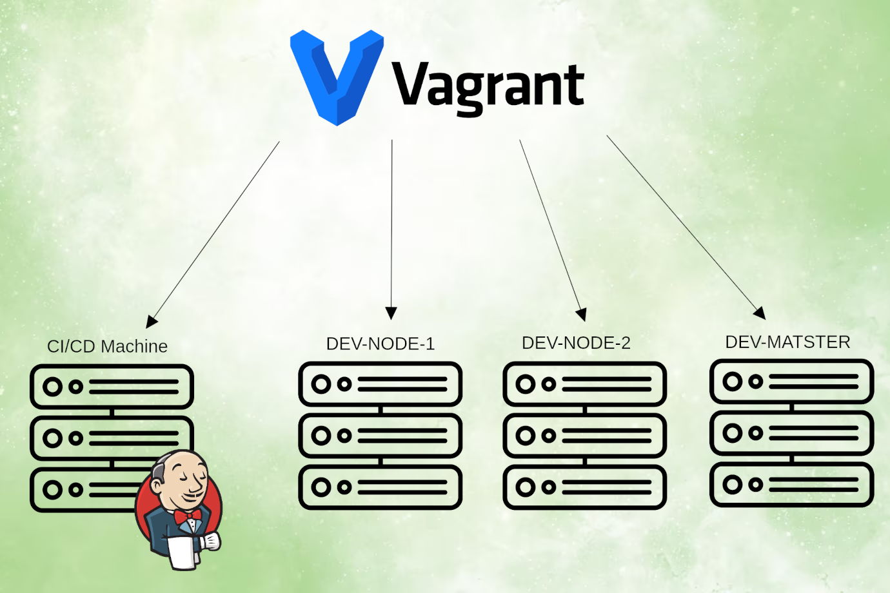
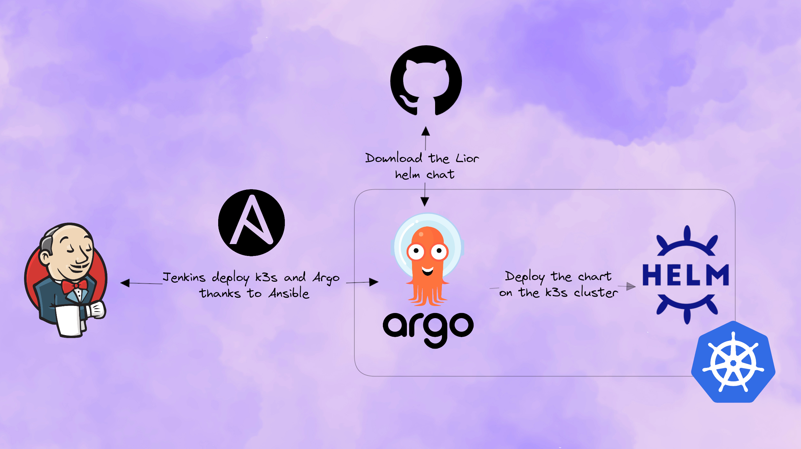

# Overcomplicated CI/CD project

The goal of the project is to deploy an application from scratch.  
We'll be deploying one of my previous project, Lior, a SpringBoot Angular application, as a Helm chart.

## Technologies used

The goal of this project is to showcase my abilities in various technologies and competencies including:

- Ansible
- Jenkins
- Docker
- Docker Compose
- Kubernetes
- Helm
- ArgoCD
- virtualization with libvrit

## Table Of Content

- Technologies
  - [Jenkins](jenkins/README.md)
  - [Ansible](ansible/README.md)

## Steps

- Vagrant provision the infrastructure: 1 CI/CD machine, and 3 machines soon to be a Kubernetes cluster

- Jenkins execute an Ansible role on the DEV-NODE-1, DEV-NODE-2, and DEV-MASTER machines. It deploy K3s and Argo on top of it.
- ArgoCD fetch the Lior Helm Chart from GitHub and deploy it

## Machines

### CI/CD Machine

The CI/CD Machine is responsible for hosting Jenkins and the Docker Registry.  
These two services are deployed using Docker Compose.

## Prerequisites

- Run on a Ubuntu 22.04 machine
- [libvirt](https://www.libvirt.org/) installed
- [Vagrant](https://www.vagrantup.com/) installed
- Configure Vagrant to run libvirt as described [here](https://computingforgeeks.com/using-vagrant-with-libvirt-on-linux/)
